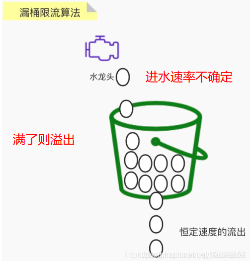
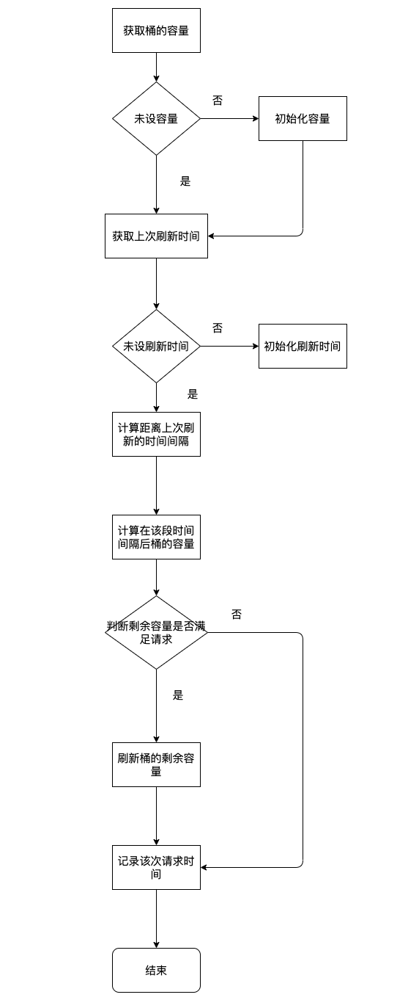

# 漏桶限流算法
漏桶限流算法的核心就是， 不管上面的水流速度有多块， 漏桶水滴的流出速度始终保持不变。

- 实际应用：消息中间件采用的就是漏桶限流的思想
- 主要作用：控制数据注入网络的速度；平滑网络上的突发流量（类似于电容整流）
- 不足：无法应对突发的并发流量，因为流出速率一直都是恒定的

如图所示，就是一个固定的桶，桶上半部分没有限制流入速率（满了会溢出），但出水速率受限于孔的大小，也就是不管多少请求，最后给服务的请求数量的速率是恒定的，多余的请求将无法通过在桶内等待

## 实现流程图

## 实现思路
### 传入的参数

- 桶的容量
- 处理请求的速率
- 该次请求需要桶的容量
- 当前时间

### 实现思路

- 通过lua脚本实现操作。一方面可以减少redis RTT的次数，另一方面可以保证操作的原子性。
- 首先获取请求参数，key值
- 判断是否是首次启动桶，如果是，初始化
- 获取上一次桶的容量，上一次刷新的时间
- 计算当前桶的容量 = Math.max(capacity,nowCapacity + 这段时间腾出来的容量)
- 判断当前桶的容量是否满足需求
- 刷新redis相关key的value
- 返回结果