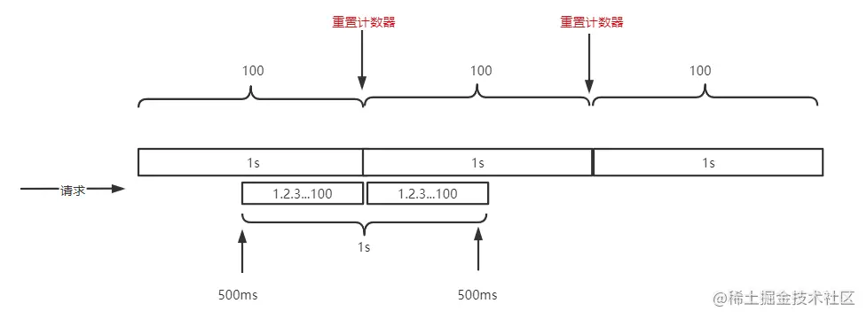
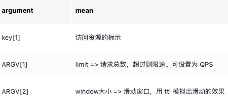
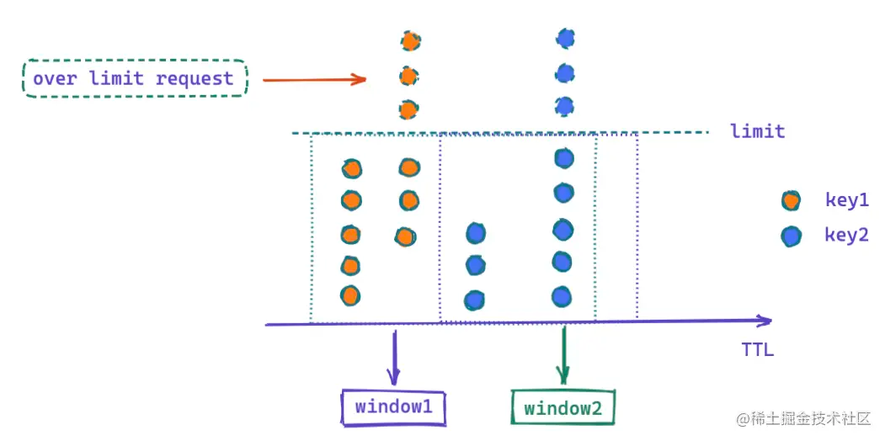
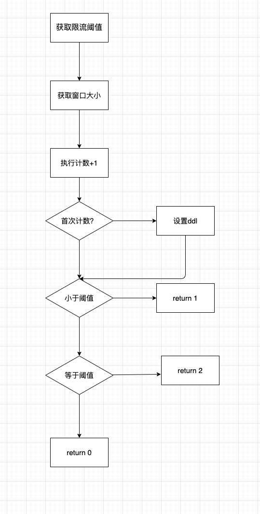

# 固定窗口算法
固定窗口算法的核心就是， 计算一段时间内对同一个资源的访问次数，如果超过指定的 limit ，则拒绝访问。当然如果你是在一段时间内访问不同的资源，每一个资源访问量都不超过 limit ，此种情况是允许大量请求进来的。

滑动窗口计数器算法概念如下：
- 将时间划分为多个区间；
- 在每个区间内每有一次请求就将计数器加一维持一个时间窗口，占据多个区间；
- 每经过一个区间的时间，则抛弃最老的一个区间，并纳入最新的一个区间；
  
固定时间窗口限流的缺点在于无法处理临界区请求突发场景。

假设每1s限流100此请求，用户在中间500ms时开始1s内发起200次请求，此时200次请求时可以全部通过的。这就和我们预期1s限流00次不合了，根源在于限流的细粒度太粗。

如果当前窗口内区间的请求计数总和超过了限制数量，则本窗口内所有的请求都被丢弃。
下面来看看 lua script 控制的几个关键属性：

滑动窗口算法示意图：

## 实现流程图

## 实现思路
### 传入的参数

- 请求阈值
- 窗口大小

### 实现思路

- 通过lua脚本实现操作。一方面可以减少redis RTT的次数，另一方面可以保证操作的原子性。
- 首先获取请求参数，key值
- 执行计数加1操作
- 判断是否是首次计数，如果是，设置过期时间
- 根据计数值判断需要返回的结果