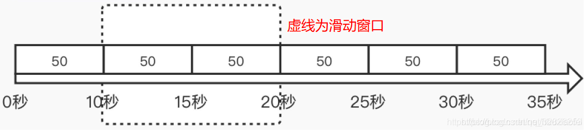
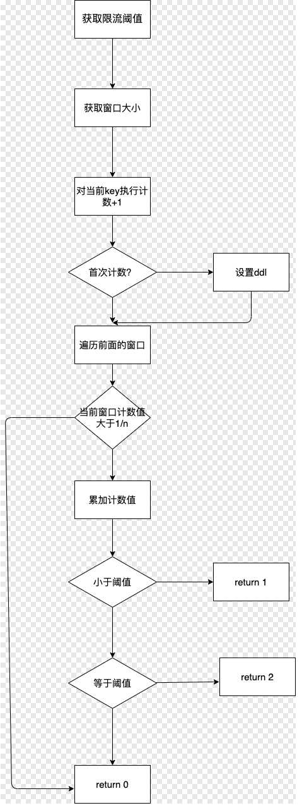

# 滑动窗口限流算法
为了避免计数器中的临界问题，让限制更加平滑，将固定窗口中分割出多个小时间窗口，分别在每个小的时间窗口中记录访问次数，然后根据时间将窗口往前滑动并删除过期的小时间窗口。

- 优点：实现相对简单，且没有计数器算法的临界问题
- 缺点：无法应对短时间高并发（突刺现象）
  
如图所示，最终只需要统计每个小时间窗口不超过阈值/n 以及 在滑动窗口范围内的所有的小时间窗口总的计数不超过阈值即可

## 实现流程图

## 实现思路
### 传入的参数

- 请求阈值
- 总窗口大小
- 单窗口大小

### 实现思路

- 通过lua脚本实现操作。一方面可以减少redis RTT的次数，另一方面可以保证操作的原子性。
- 首先获取请求参数，key值
- 执行计数加1操作
- 判断是否是首次计数，如果是，设置过期时间
- 遍历之前的窗口
- 判断当前窗口是否大于阈值的1/n,如果是，返回
- 累加计数值
- 根据总计数值判断需要返回的结果