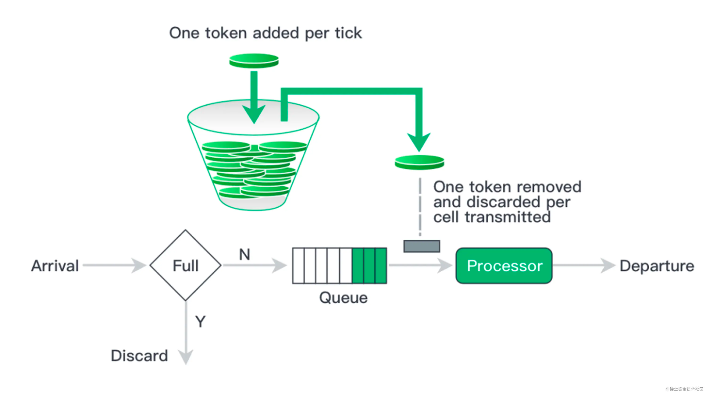
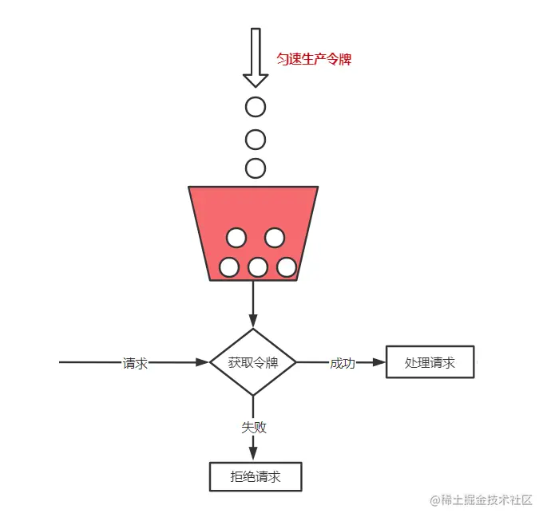
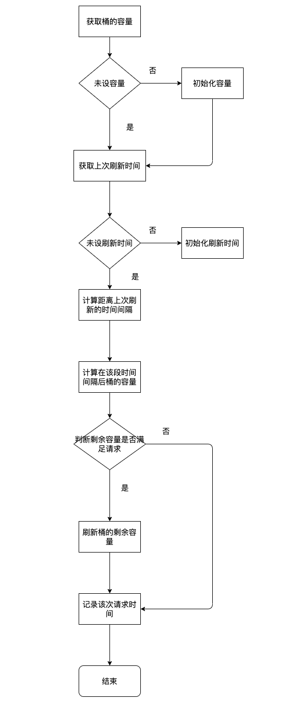

# 漏桶限流算法
令牌桶算法概念如下：
- 令牌以固定速率生成；
- 生成的令牌放入令牌桶中存放，如果令牌桶满了则多余的令牌会直接丢弃，当请求到达时，会尝试从令牌桶中取令牌，取到了令牌的请求可以执行；
- 如果桶空了，那么尝试取令牌的请求会被直接丢弃。

令牌桶算法既能够将所有的请求平均分布到时间区间内，又能接受服务器能够承受范围内的突发请求，因此是目前使用较为广泛的一种限流算法。

## 实现流程图

## 实现思路
### 传入的参数

- 桶的容量
- 产生令牌的速率
- 该次请求需要令牌的数量量
- 当前时间

### 实现思路

- 通过lua脚本实现操作。一方面可以减少redis RTT的次数，另一方面可以保证操作的原子性。
- 首先获取请求参数，key值
- 判断是否是首次启动桶，如果是，初始化
- 获取上一次桶的容量，上一次刷新的时间
- 计算当前桶的容量 = Math.max(capacity,nowCapacity + 这段时间生产的令牌的数量)
- 判断当前令牌的数量是否满足需求
- 刷新redis相关key的value
- 返回结果